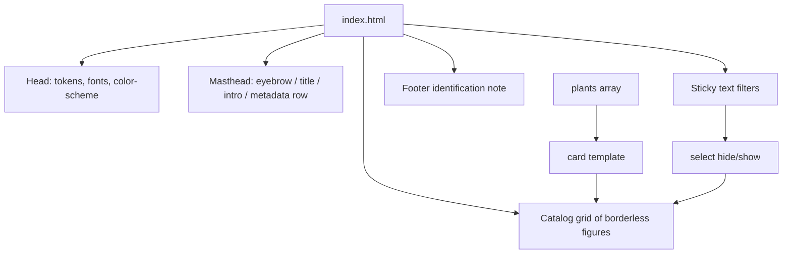
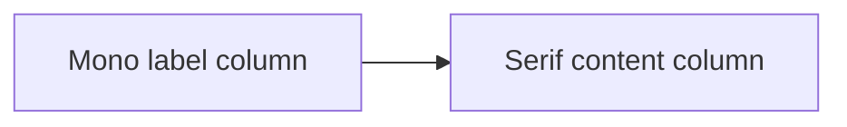
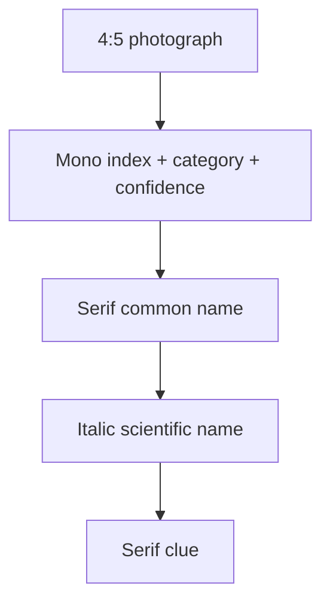

# Editorial Dark Restyle - Plan

## Goal Capsule

- **Objective:** Restyle the Bray walks living field guide so it reads as a dark, quiet editorial catalog: charcoal ground, serif body, monospace labels, sparse terracotta, hairline rules, and borderless photographs.
- **Authority:** User visual reference (style only; ignore its copy and subject) > this plan > current `index.html` structure and plant records.
- **Execution profile:** Standard. Single-file static HTML/CSS/JS. No build step. No new pages.
- **Stop conditions:** Stop if the work would rewrite plant records, add a framework or bundler, add a second page, or invent a light/dark toggle. Stop if a local generator would be required to ship the look.
- **Tail ownership:** The implementer owns visual QA in a real browser at desktop and phone widths, including filter behaviour and focus visibility.

---

## Product Contract

### Summary

The site stays a one-page field guide of family photographs from Bray walks. The moss-and-paper notebook look is replaced with the visual language of the supplied editorial reference. Plant names, Latin names, confidence labels, clues, categories, and image files stay as they are. Category filtering stays.

### Problem Frame

The current page is a light field notebook: cream paper, moss pills, bordered cards, and a 4:3 crop on portrait photos. The user wants a cleaner, more minimal page and pointed at a dark editorial specimen as the style to copy. That specimen is not a content template. It is a type, colour, and layout language: serif plus mono, charcoal, terracotta used sparingly, left-hand labels, thin rules, and photographs without chrome.

### Requirements

**Visual language**

- R1. The page uses a forced dark charcoal ground with warm off-white primary text, not the current cream paper and moss palette.
- R2. Body and plant names use a Garamond-like serif. Eyebrows, labels, captions, stats, and filters use a modern monospace.
- R3. A single warm terracotta accent is used sparingly (active filter, optional catalog index, small markers). Headings stay off-white.
- R4. Surfaces have no pill chips, card borders, box shadows, or heavy radius. Separation is whitespace and 1px hairline rules.
- R5. At desktop width, the masthead and footer use a left-label / right-content split. The photo grid stays a captioned catalog, not a left-label dossier per row.

**Content preservation**

- R6. The `plants` array records stay byte-stable: do not edit names, scientific names, confidence strings, categories, image filenames, or clues.
- R7. Every sighting still shows photograph, common name, scientific name, category, confidence, and clue.
- R8. The identification footnote keeps its meaning: “Probable” remains visible where the photo does not prove the species.

**Filtering**

- R9. Filters remain All plus each distinct `category` in first-seen data order, derived at runtime.
- R10. The active filter is visible without hue alone (underline or hairline plus terracotta).
- R11. Filtering hides non-matching sightings without rebuilding the grid. The empty message still appears if a filter would show none.
- R12. Filter controls remain native buttons with at least a 44px tap target and a visible `:focus-visible` ring. A filter change announces the visible count in a polite live region that is not the grid.

**Responsive and motion**

- R13. The photo catalog is three columns on wide viewports, two on medium, one on small, using the existing 850px and 560px breakpoints unless a layout bug forces a small shift.
- R14. Photographs do not zoom on hover. `prefers-reduced-motion: reduce` disables remaining motion, including smooth scroll.

### Actors

- A1. Family reader on phone or laptop, scanning photos and filtering by patch.
- A2. Keyboard user tabbing filters and reading sightings.

### Flows

- F1. Open the guide
  - **Trigger:** A1 loads `index.html`.
  - **Outcome:** Masthead, count, All filter selected, all 23 sightings visible in the catalog.
- F2. Filter a patch
  - **Trigger:** A1 or A2 activates a category control.
  - **Outcome:** Only matching sightings remain. Active control is marked. Other controls are not marked.
- F3. Ferns (single-item category)
  - **Trigger:** A1 activates Ferns.
  - **Outcome:** Exactly one sighting remains. Empty message stays hidden.

### Acceptance Examples

- AE1. Landing
  - **Covers:** R1, R2, R7, R9
  - **Given:** A cold load of the page
  - **When:** The reader looks at the first screen and the catalog
  - **Then:** The ground is charcoal, type is serif plus mono, All is selected, and all 23 photographs with names and clues are present
- AE2. Filter Trees
  - **Covers:** R9, R10, R11
  - **Given:** All sightings are visible
  - **When:** The reader activates Trees
  - **Then:** Non-tree articles are not visible, Trees is the only active control, and the empty message is hidden
- AE3. Keyboard focus
  - **Covers:** R12
  - **Given:** Keyboard focus is on a filter
  - **When:** The user tabs
  - **Then:** A focus ring is visible against the dark ground and Enter/Space activates the control

### Success Criteria

- A reader comparing the live page to the style reference recognises the same type pairing, dark ground, sparse terracotta, hairline rules, and borderless photos.
- Plant data and image files are unchanged.
- Category filtering still works, including Ferns.

### Scope Boundaries

**In scope**

- Restyle CSS in `index.html`.
- Restructure masthead, filter chrome, `card()` markup, and footer markup to carry the new language.
- Load two webfonts.
- Harden filter JS so restyled markup cannot break click handling.

**Deferred**

- Light-theme variant or system `prefers-color-scheme` toggle.
- Splitting CSS/JS into extra files.
- Re-encoding or renaming JPEGs.
- A local generator that cannot overwrite the hand-styled page.

**Outside this product**

- Screenshot copy, brand name, and subject matter.
- New pages, CMS, maps, or search.
- Authentication, analytics, or a component library.

### Sources

- User visual reference (style only).
- `index.html` current tokens, layout, `plants` array, `card()`, and `select()`.
- WCAG 2.2 contrast, target size, and focus-not-obscured guidance used to lock token floors.

---

## Planning Contract

### Key Technical Decisions

- KTD1. **Forced dark editorial theme.** Ship charcoal as the only theme (`color-scheme: dark` on `:root`). Do not keep the cream field-notebook palette and do not add a theme toggle. (session-settled: user-directed — chosen over restyling the current light paper in place: the reference is dark and the user asked to replicate that style, not its content.)
- KTD2. **Stay in `index.html`.** Keep the GitHub Pages contract: one HTML file, relative `images/` paths, `.nojekyll`, no bundler. Put every colour, type family, and space decision in `:root` tokens and use those tokens everywhere, including the sticky bar.
- KTD3. **EB Garamond + IBM Plex Mono via Google Fonts css2.** Load static weights only: Garamond 400/600 plus italic 400; Plex Mono 400/500. Preconnect `fonts.googleapis.com` and `fonts.gstatic.com` (`crossorigin` on gstatic). Fallback: `"Iowan Old Style", Palatino, Georgia, serif` and `ui-monospace, SFMono-Regular, Menlo, Consolas, monospace`. Do not use Cormorant Garamond (too thin for dark captions). Do not use the v1 `/css` API.
- KTD4. **Locked palette (AA on `#121212`).** `--bg: #121212`; `--text: #E8E4DC`; `--muted: #A8A49C`; `--accent: #E07A5F`; `--rule: #2A2A2A`; `--focus: #E8E4DC`; `--photo-well: #1C1C1C`. Do not use muted greys darker than about `#808080` for small type. Do not put terracotta on large headings.
- KTD5. **Text filters, not pills.** Restyle `#filters button` to appearance-none text controls in `--font-mono` at weight 500. Active state is `aria-pressed="true"` plus underline and `--accent`. All starts with `aria-pressed="true"` in markup. Keep 44px targets via padding. Scope CSS and JS to `#filters button`. On click, resolve `const btn = event.target.closest('button')` and read `btn.dataset.filter` (do not read `event.target.dataset.filter`). Pad or wrap the sticky row so the focus ring is not clipped by `overflow-x: auto`. Set `html { scroll-padding-top }` to the sticky bar height.
- KTD6. **Borderless catalog, 4:5 crop.** Drop card fill, border, and radius. Keep a CSS grid of articles. Photos sit in a 4:5 well with `object-fit: cover` and `object-position: center 20%`. Sources mix 3:4 (960×1280) and 9:16 (720×1280); 4:5 is a compromise, not a native ratio. Identification text stays under the photo as caption, not overlay. Caption type stays small enough that three columns still scan. No hover zoom.
- KTD7. **Masthead as editorial spread.** Mono eyebrow, large serif title, intro measure, then a metadata row (count / place / living). Hairline under the header. Sticky filter row is a thin rule plus text, without backdrop blur. Footer is a hairline plus the identification note in the same label/content split as the masthead on desktop.
- KTD8. **Presentation-only markup in `card()`.** `card()` may add a zero-padded index, `<figure>`/`<figcaption>` wrappers, and extra label spans. It must keep interpolating the existing plant fields and must not change the `plants` array. Preserve `article.card` and `data-category`. Hide behaviour is owned by KTD9.
- KTD9. **Harden `select()` while keeping hide-not-rebuild.** Toggle `hidden` on existing `.card` nodes. Keep `.card[hidden] { display: none }` so hidden cards leave no grid hole. Do not `innerHTML` the grid on filter. Scope active-state queries to `#filters button` and set `aria-pressed` there (required, not optional). Keep `#empty` display toggling. Remove `aria-live` from the grid. Update a visually hidden polite live node with the visible count (for example “8 sightings in Trees”).

### Assumptions

- Dark charcoal is the intended skin. The user supplied a dark reference and asked to copy its style. Outdoor glare on a dark page is accepted for this pass (no light theme).
- A three-column photo catalog remains the right IA for 23 sightings. A single-column long-form dossier is out of scope.
- Google Fonts CDN is acceptable for this personal GitHub Pages site. Self-hosting WOFF2 is deferred.
- Chrome copy may replace the word “card” in the intro with “entry” or “photograph” so the voice matches the new layout. Plant records stay untouched.
- If a catalog index is added, it is optional style chrome from array order, not new data (R3 / KTD8).

### Implementation Constraints

- Relative image URLs only. The site is project Pages at `/bray-walks/`, not domain root.
- No new npm dependencies, CSS frameworks, or test runner. The repo has none.
- Do not commit `build_site.py`. If a local generator exists, the restyle must remain a hand edit of `index.html` that a naive regenerate would clobber — call that out in the PR, do not invent a generator in this work.
- `document.querySelectorAll('button')` is unsafe once any non-filter button exists. Scope it in this change even if no extra button is added.

### High-Level Technical Design

The page is still three static regions plus a JS-filled catalog. The restyle changes region composition, not data flow.

Desktop masthead and footer:

Catalog cell:

### Sequencing

1. U1 tokens and fonts so later CSS cannot leave moss leftovers.
2. U2 masthead and footer chrome.
3. U3 filter controls and JS scoping (can follow U2; needs U1).
4. U4 catalog markup and grid. Last, because it depends on tokens and on `[hidden]` still winning against the new article display.

---

## Implementation Units

### U1. Token and type foundation

- **Goal:** Replace the moss/paper token set and load the serif/mono pairing so every later unit paints from one dark palette.
- **Requirements:** R1, R2, R3
- **Dependencies:** None
- **Files:** `index.html` (`<head>` links, `:root`, `html`/`body` base type)
- **Approach:**
  1. Add css2 `<link>` tags per KTD3.
  2. Replace `:root` with KTD4 tokens plus `--font-serif`, `--font-mono`, `--tap: 44px`, `--photo-ratio: 4 / 5`, `--max: 1180px`.
  3. Set `color-scheme: dark` per KTD1. Body background, color, and font come from tokens.
  4. In this unit, retoken leftover hexes that would fail on charcoal if U1 shipped alone: `.clue` to `--muted`, photo wells to `--photo-well`. Delete unused `--soft`.
- **Test scenarios:**
  - With the stylesheet applied, `body` computed background is `#121212` and color is `#E8E4DC`.
  - `.clue` computed color is `--muted`, not `#38473e`.
  - Network load of the page requests Google Fonts css2 (not `/css?family=`) and only the named families/weights.
- **Verification:** Open `index.html` locally. Confirm the page ground is charcoal before chrome is fully redesigned. Confirm no 400 from the fonts URL.

### U2. Editorial masthead and footer

- **Goal:** Make the header and footer read as the reference spread: mono labels, large serif title, metadata row, hairlines. No gradient wash.
- **Requirements:** R1, R2, R3, R4, R5, R8
- **Dependencies:** U1
- **Files:** `index.html` (`<header>`, `.stats` / metadata markup, `<footer>`, related CSS)
- **Approach:**
  1. Apply KTD7. Drop the header gradient. Use padding and a bottom hairline only.
  2. Keep existing copy in spirit. Eyebrow stays a living-family-guide line in `--font-mono` uppercase. Title stays “Our Bray walks” in `--font-serif` and `--text` (not `--accent`). Intro may say photograph/entry instead of card.
  3. Rebuild `.stats` as a metadata row of label/value pairs in mono (count from `#count`, plus a place line such as Bray, plus the existing “growing” line).
  4. On viewports wider than 850px, place a short mono section label in a left column and the title block to the right. Stack on small screens. Do not apply that split to catalog rows (R5).
  5. Footer: top hairline, same split, identification note unchanged in meaning. `strong` uses `--text`, body uses `--muted`.
- **Test scenarios:**
  - Header has no green gradient and no pill-like stats dots as the primary motif.
  - `#count` still receives `${plants.length} sightings so far` (or equivalent count string) from JS.
  - Footer still states that Probable remains visible when the photo does not prove the species.
  - At a ~390px width, the label column stacks above the title; nothing overlaps.
- **Verification:** Desktop and phone screenshots of header and footer against the style reference: quiet, dark, labeled, not notebook-like.

### U3. Text filters with accessible state

- **Goal:** Keep category filtering and restyle controls to match the reference’s UI-as-text, without shrinking tap targets or losing keyboard use.
- **Requirements:** R2, R3, R4, R9, R10, R11, R12
- **Dependencies:** U1
- **Files:** `index.html` (`.controls` CSS, `select()`, filter click handler, `aria-pressed` on buttons, live status node)
- **Approach:**
  1. Apply KTD5 and KTD9. Remove global pill `button` rules. Namespace to `#filters button` in `--font-mono` weight 500.
  2. Markup: All starts with `aria-pressed="true"`. Drop `.active` as the source of truth.
  3. `:focus-visible` uses a 2px `--focus` outline with offset. Pad or wrap the sticky row so the ring is not clipped.
  4. Sticky bar: `--bg`, bottom hairline, no `backdrop-filter`.
  5. `select()` queries `#filters button` only, sets `aria-pressed`, toggles `hidden` on cards, updates `#empty`, and writes the visible count to a visually hidden polite live node.
  6. Click handler: `const btn = e.target.closest('button'); if (btn && filters.contains(btn)) select(btn.dataset.filter)`.
  7. `html { scroll-padding-top }` sized to the sticky row.
- **Test scenarios:**
  - Default: All is pressed in markup; 23 articles visible; empty message hidden; live node exists.
  - Click Trees: only `data-category="Trees"` articles visible; Trees is the only `aria-pressed="true"`; live node text includes the visible count.
  - Click Ferns: exactly one article visible; empty message hidden.
  - Click All: all articles visible again.
  - Tab through filters: each shows a visible unclipped ring; Enter/Space selects.
  - Clicking a child text node inside a button still selects (`closest` plus `btn.dataset.filter`).
- **Verification:** Manual filter pass on a static server. Confirm no other future button would be toggled by `select()`.

### U4. Borderless sighting catalog

- **Goal:** Present each plant as a captioned photograph in an editorial grid, with identification text intact and filtering still hiding articles.
- **Requirements:** R2, R3, R4, R5, R6, R7, R11, R13, R14
- **Dependencies:** U1, U3
- **Files:** `index.html` (`card()`, `.grid` / `.card` / `.photo` / `.content` CSS, reduced-motion)
- **Approach:**
  1. Apply KTD6 and KTD8. Change `card()` to a figure-like article: photo well, then caption block (optional 01-style index, category, confidence, `h2` name, italic scientific, clue). Keep `class="card"` and `data-category`.
  2. CSS: no background, border, or radius on `.card`. Photo `aspect-ratio: var(--photo-ratio)` (4/5). `img` uses `object-fit: cover` and `object-position: center 20%`. Caption type: small mono for meta, serif for name/clue. Keep caption density low enough for three-column scan.
  3. Hide behaviour per KTD9: `.card[hidden] { display: none }`.
  4. Grid gaps about 2rem so borderless photos do not merge. Breakpoints stay 3 / 2 / 1 columns. Do not turn rows into left-label dossiers (R5).
  5. Remove hover scale. `prefers-reduced-motion` also sets `scroll-behavior: auto` and `transition: none` on images.
  6. Do not edit the `plants` array. First-row images may use default lazy loading; do not introduce overlay captions.
- **Test scenarios:**
  - All 23 `images/*.jpg` files still load. Alt text still names the plant.
  - Each visible article shows name, scientific name, category, confidence, and clue.
  - After Ferns is selected, the catalog shows one article and does not leave a blank flex hole (`hidden` is `display: none`).
  - At 1200px, three columns; at 800px, two; at 500px, one. Images do not collapse before decode (reserved aspect-ratio).
  - Hovering a photo does not scale it. With reduced motion, no image transition.
- **Verification:** Walk the catalog visually against the reference: photos sit on charcoal with small mono captions, no card frames. Confirm 9:16 subjects are not cropped only at dead-center (use `object-position: center 20%`).

---

## Verification Contract

This repo has no test runner, linter, or CI besides GitHub Pages deploy.

**Gates**

- Serve the tree (`python3 -m http.server` or equivalent). Do not rely on `file://` alone for font and focus checks.
- Cold load: 23 sightings, All active, all images 200.
- Filter All / Trees / Ferns / Wildflowers / Shrubs. Ferns shows one. Empty copy stays hidden for current data.
- Keyboard: tab filters, visible focus ring, activate with Enter.
- Contrast: `--text`, `--muted`, `--accent` on `--bg` still meet 4.5:1 for small type (use the KTD4 hexes; do not invent darker muted).
- Viewports: ~1280px, ~800px, ~390px. Sticky filters must not fully cover a focused control (scroll-padding).
- Reduced motion: no photo motion.
- Diff: `plants` JSON unchanged; `images/` unchanged; `.nojekyll` remains.

**Not in scope for this plan:** `release:validate`, unit tests, Lighthouse CI. A Lighthouse CLS glance is useful but not a gate.

---

## Definition of Done

- U1–U4 complete against their verification bullets.
- Product requirements R1–R14 are each met by a named unit.
- Abandoned CSS (moss tokens, pill rules, unused `--soft`, header gradient, hover zoom) is removed, not commented out.
- Plant records and JPEGs are untouched.
- A person can open the published-style page and match it to the reference’s type, colour, and quiet layout without seeing screenshot copy on the page.

---

## Risks and Dependencies

- **Local `build_site.py`:** `.gitignore` lists it. Regenerating the page would wipe the restyle. Mitigation: restyle only `index.html`; mention the clobber risk in the PR.
- **Google Fonts CDN:** Extra request and IP to Google. Fallback stack keeps the page readable if the CDN fails.
- **Mixed JPEG ratios:** Fifteen files are 720×1280 (9:16) and eight are 960×1280 (3:4). A 4:5 well still crops 9:16. Mitigation: `object-position: center 20%` (KTD6). Native 3:4 in three columns makes a very long page.
- **Sticky filters vs WCAG 2.4.11 / 2.4.7:** Mitigation is `scroll-padding-top`, a short sticky bar, and padding/wrap so `overflow-x` does not clip the focus ring (KTD5).
- **Global `button` JS:** Mitigation is U3 scoping per KTD5/KTD9.
- **Filter announcement:** Removing `aria-live` from the grid would silence filter changes. Mitigation: a visually hidden polite live node updated in `select()` (KTD9 / R12).

---

## Sources and Research

- `index.html` — tokens, pill filters, 4:3 crop, `card()`, unscoped `querySelectorAll('button')`, `.card[hidden]`.
- `images/*.jpg` — 23 portrait files (sampled 720×1280 and 960×1280).
- Google Fonts css2 — axis order `ital,wght`; `display=swap`; do not use v1 `/css`.
- WCAG 2.2 — 1.4.3 contrast, 1.4.11 non-text contrast, 2.4.7 focus visible, 2.4.11 focus not obscured, 2.5.8 target size.
